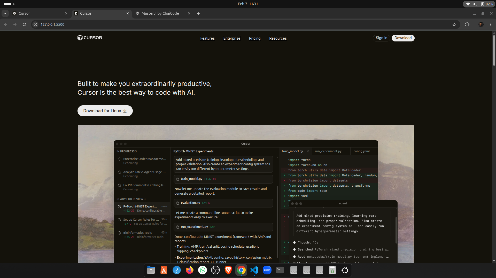

# Cursor Website Clone (HTML & CSS)

This project is a **static HTML & CSS recreation** of the Cursor website UI.  
The goal was to closely match the original layout, typography, colors, and overall visual feel using **pure HTML and CSS**.

---

## Live Demo

**Live Website:**  
https://koushik-chowdhury.github.io/cohort-2/assignments/cursor-clone/

**GitHub Repository:**  
https://github.com/koushik-chowdhury/cohort-2/tree/master/assignments/cursor-clone

---

## Sections Recreated

All major sections from the reference design were recreated:

1. **Top Navigation Bar**
   - Logo
   - Navigation links
   - Primary CTA button
   - Dark background theme

2. **Hero Section**
   - Main headline
   - Description text
   - Call to action button
   - Large product screenshot

3. **Trusted By / Logos**
   - Horizontal row of company logos

4. **Feature Sections (3 Blocks)**
   - Two-column layout (text + image)
   - Alternating image/text alignment

5. **Feature Cards Section**
   - Section heading
   - Grid layout with multiple feature cards

6. **Testimonials**
   - Quote cards
   - Author name and role

7. **Use Cases / Stories**
   - Card layout with image and short description

8. **Changelog / Updates**
   - List of updates with date information

9. **Team / About Section**
   - Large image
   - Short description
   - CTA button

10. **Final Call To Action**
    - Large heading
    - Single prominent button

11. **Footer**
    - Multi-column layout
    - Useful links
    - Company information

---

## 🎨 Fonts Used

- **Inter**
  - Clean, modern sans-serif font
  - Used across the entire website for consistency
  - Source: Google Fonts

---

## 🎨 Colors Used

### Surface Colors

- Primary Background: `#14120b`
- Secondary Background: `#1b1913`

### Content Colors

- Primary Text: `#edecec`
- Secondary Text: `#edecec99`

### Button Colors

- Primary Button Background: `#edecec`
- Primary Button Hover: `#d7d6d5`
- Primary Button Text: `#14120b`

- Secondary Button Background: `#14120b`
- Secondary Button Hover: `#1b1913`
- Secondary Button Text: `#edecec`

- Tertiary Button Background: `#f54e00`
- Tertiary Button Hover: `#f54e00bf`

### Border Colors

- Button Border: `color-mix(in oklab, #edecec 20%, transparent)`
- General Border: `rgba(255, 255, 255, 0.02)`

---

## 🖼️ Screenshots

