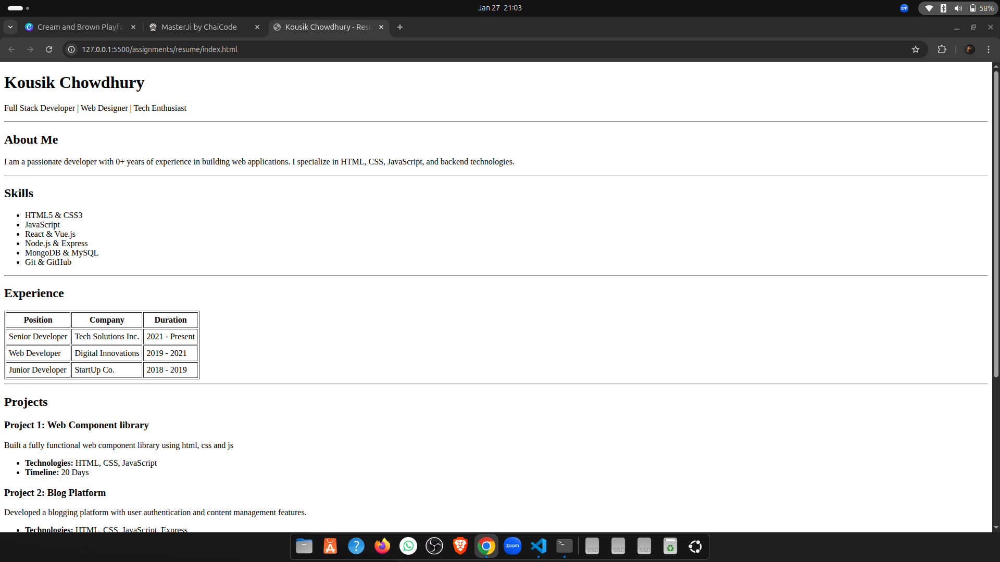
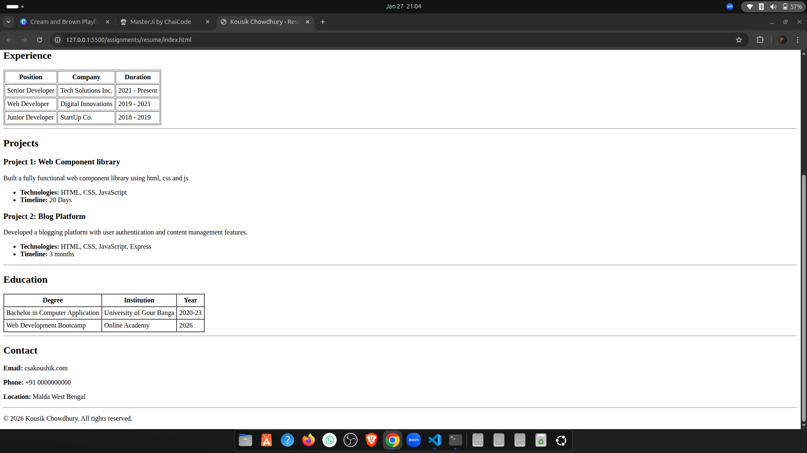

# HTML Resume Demo

A simple, semantic HTML resume webpage built using only HTML.
This project demonstrates proper HTML structure, accessibility,
and clean layout without any CSS or JavaScript.

---

## Features

- Pure HTML (no CSS or JS)
- Semantic tags (`h1`, `h2`, `table`, `ul`, etc.)
- Easy to read and ATS-friendly
- Beginner-friendly structure

---

## Demo

🔗 **Live Demo (GitHub Pages):**  
https://koushik-chowdhury.github.io/cohort-2/assignments/resume

---

## Setup Instructions

1. Clone the repository
   ```bash
   git clone https://koushik-chowdhury.github.io/cohort-2/assignments/resume

   

2. Navigate to the project folder
3. Open index.html in your browser

## Usage
- Modify content in `index.html` to add your own details
- Use it as:
    - A basic resume webpage
    - Html practice project

## 🌐 Connect with Me

- 🐦 X (Twitter): https://x.com/csakoushik  
- 💼 LinkedIn: https://www.linkedin.com/in/kousik-chowdhury/


## 📸 Screenshot



